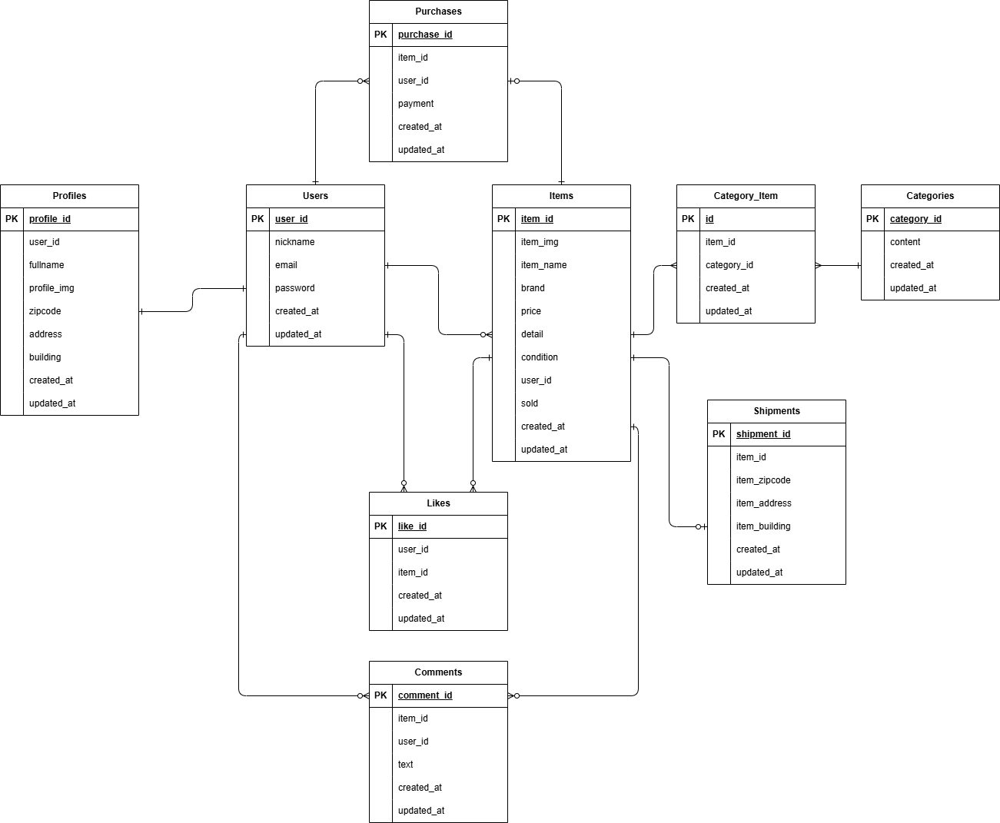

# 新模擬案件_フリマアプリ
  
## プロジェクト概要
- サービス名  
    coachtechフリマ
- サービス概要  
    ある企業が開発した独自のフリマアプリ
- 制作の背景と目的  
    アイテムの出品と購入を行うためのフリマアプリを開発する
- 制作の目標  
    初年度でのユーザー数1000人達成
- ターゲットユーザー  
    10~30代の社会人
- ターゲットブラウザ・OS  
    PC：Chrome/Firefox/Safari 最新バージョン
- 開発手法  
    開発言語：PHP  
    フレームワーク：Laravel  
    バージョン管理：Docker, GitHub  
  
## 環境構築
- Dockerビルド  
    ・git clone git@github.com:misaki-nonaka/mock-case-1.git  
    ・cp src/.env.example .env  
    ・docker-compose up -d --build  

- Laravel環境構築  
    ・cp src/.env.example src/.env　、適宜環境変数変更  
    ・docker-compose exec php bash  
    ・composer install  
    ・php artisan key:generate  
    ・php artisan migrate  
    ・php artisan db:seed  

- Stripe決済環境構築  
    ＊Stripe Checkout + Webhookを使用しています。  
    　購入完了処理はWebhookにより確定するため、  
    　動作確認にはStripe CLIの起動が必要です。  
  
    - 手順  
    1 Stripe CLI コンテナを起動  
    　docker run --rm -it stripe/stripe-cli:latest login  
    　ブラウザを開きStripeにログイン  
    2 環境変数の設定  
    　https://dashboard.stripe.com/test/apikeys にアクセスしAPIキーを取得する  
    　/src/.env のSTRIPE_KEYおよびSTRIPE_SECRETに変数を入力する  
    3 開発環境にイベントを転送する  
    　docker run --rm -it \ 
      --network mock-case-1_flea-market_default \ 
      -e STRIPE_API_KEY=sk_test_XXXXXXXXXXXXXXXX \ 
      stripe/stripe-cli:latest \ 
      listen --forward-to http://nginx:80/stripe/webhook  
    4 /src/.envにWebhookの秘密鍵を登録する  
    　STRIPE_WEBHOOK_SECRET=XXXXXXXXXXXXXXXX  
  
    - 決済動作確認  
    ・コンビニ支払いの場合  
    　コーチの指導により、コンビニ支払いの場合はStripeを経由せずに即時購入完了処理がされます。  
    ・カード支払いの場合  
    　カード番号: 4242 4242 4242 4242  
    　有効期限: 任意の未来日  
    　CVC: 任意  
    ・購入完了処理は以下が実行されます  
    　purchases.status が paid に更新  
    　items.sold が 1 に更新  
    　shipments レコードが作成される  
  
- 開発環境  
    ・商品一覧画面（トップ画面）：http://localhost/  
    ・ログイン画面：http://localhost/login  
    ・プロフィール画面：http://localhost/mypage  
    ・商品出品画面：http://localhost/sell  
    ・phpMyAdmin：http://localhost:8080/  
  
- ユーザーログイン情報  
    ・メール認証済みユーザー  
    　email：sample1@sample.com  
    　password：sample01  
    ・未認証ユーザー  
    　email：sample2@sample.com  
    　password：sample02  
  
## 使用技術(実行環境)
・PHP 8.1.34  
・Laravel 8.83.8  
・MySQL 8.0.26  
・nginx 1.21.1  
・phpMyAdmin 5.2.3  
・mailhog 1.0.1  
・Stripe CLI 1.35.0  
  
## テスト方法
php artisan test  
  
## ER図
  
  
  
## 機能要件について
機能要件に明記されていない機能について、以下のように実装しています。
- ログインユーザーのみがいいねできる
- 購入済み商品は一覧ページから詳細ページへのリンクを無効にする
- 購入済み商品は詳細ページの「購入手続きへ」ボタンを無効にする
- コンビニ払いの場合はStripe決済を経由せず、即時決済完了とする。  
　(コーチとの打ち合わせにより)
- カード払いでStripe決済画面に移行した際、一度Purchaseテーブルに送付先住所を仮保存し、statusをpendingとする
- Stripe決済が完了すると、商品一覧画面に遷移し、失敗した場合は商品詳細画面へ遷移する
- 「認証はこちらから」のボタンを押すと、Mailhog受信箱へ遷移する
